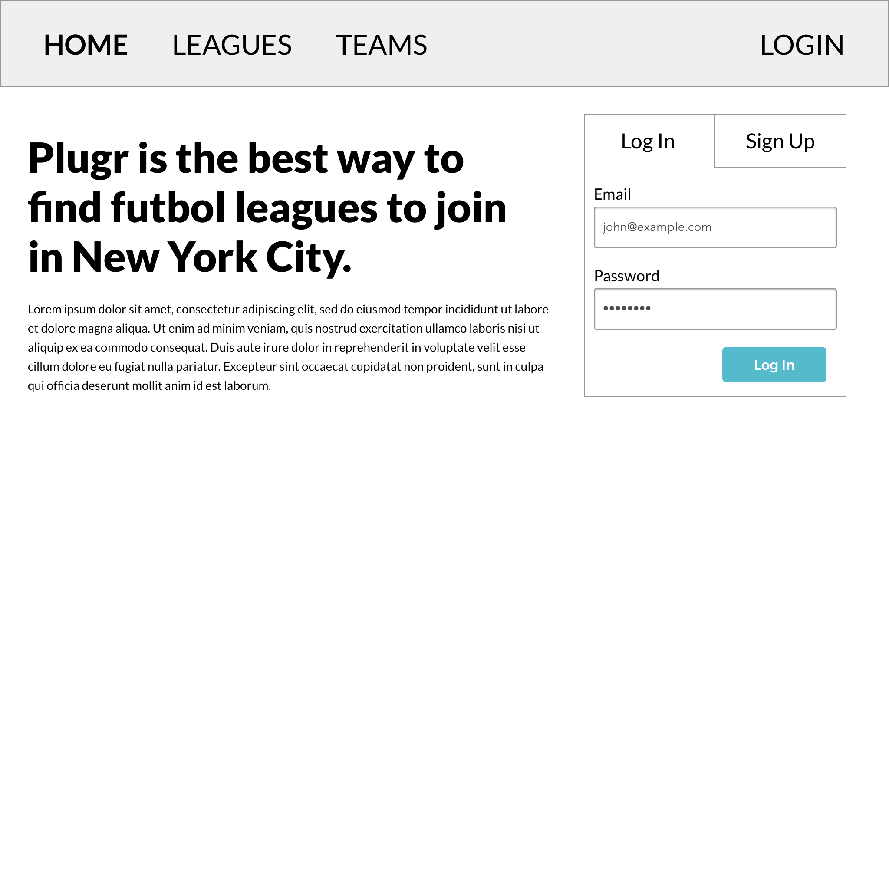
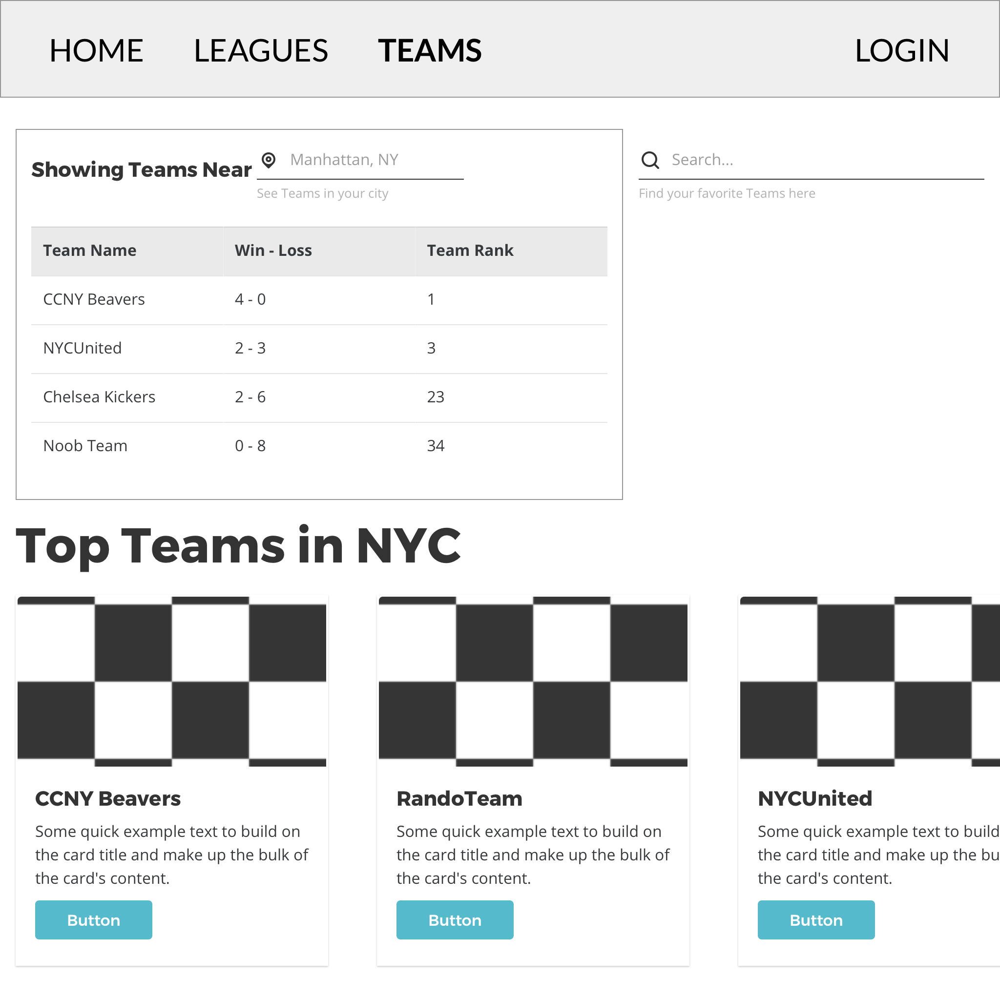
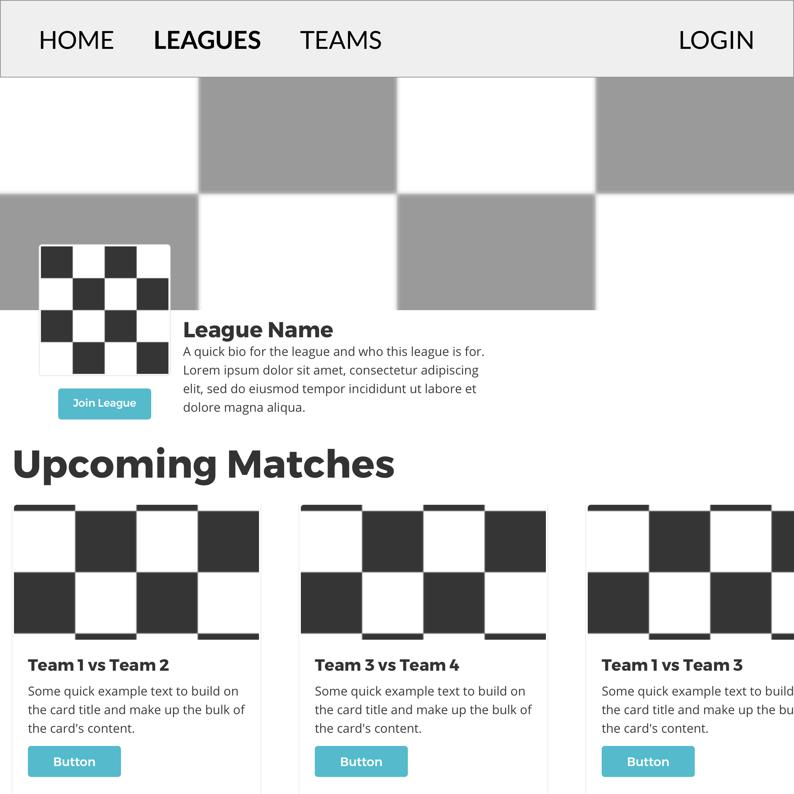
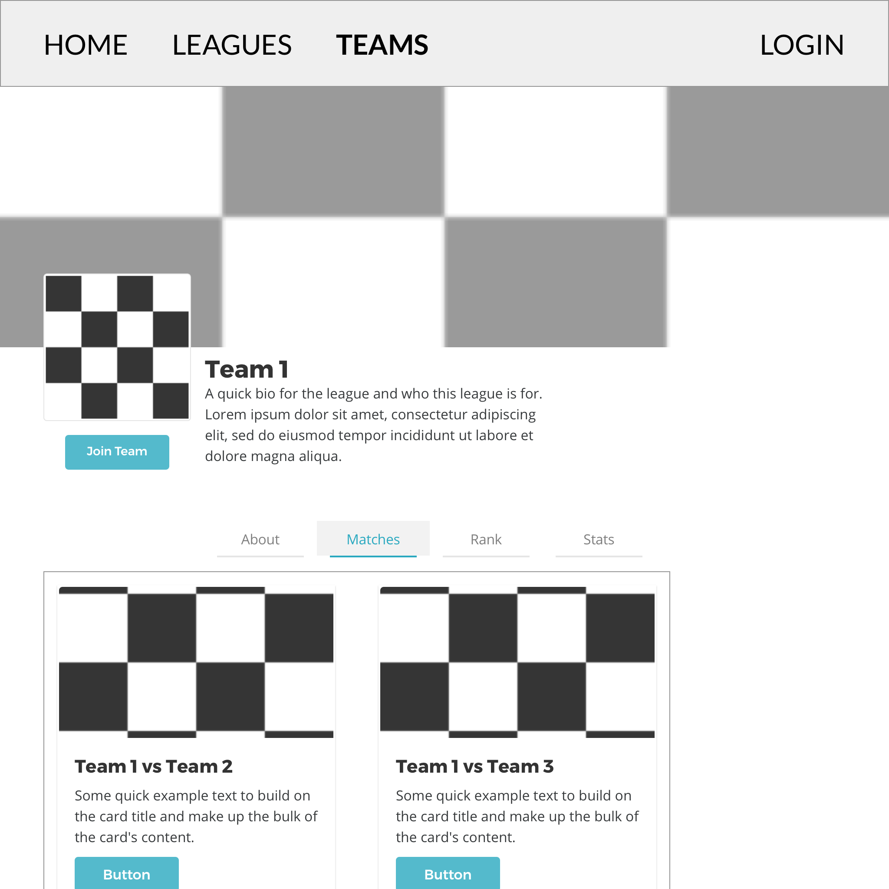
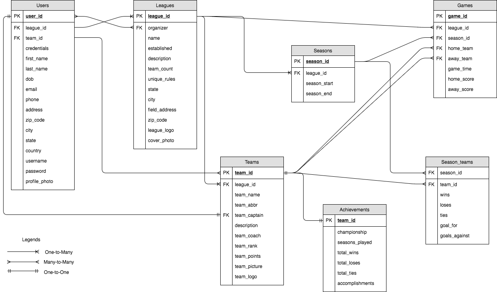

# CTP-Plugr

## CUNY Tech Prep - Section 3 - Football Plugr

----	
### Getting started with the boilerplate code:

----	
#### Clone the repo and run 
    $ npm install
>installation can take a minute

----
### When developing

----
#### Running the Development server
	$ npm run build
	$ npm run dev
> hot reloading is enabled in the dev server, rebuilds the app everytime you cmd-save / ctrl-save

----
### On Deployment

----
#### Running the Production server
	$ npm run build
	$ npm run start
> building the code is required everytime you made changes to the code 

----
#### Any questions about the template, hit me up on slack
> This boilerplate code comes from the following repo
> https://github.com/bertho-zero/react-redux-universal-hot-example 
> I cleaned it up and simplified it to fit our needs. They have docs about this template, read them when you get a chance.

#### Wireframes for MVP

+ Home Page (Landing)
	+ 
+ Leagues Page (Logged Out)
    + 
+ Teams Page (Logged Out)
	+ 
+ Leagues Profile
	+ 
+ Teams Profile
	+ 

### Database ER Diagram
